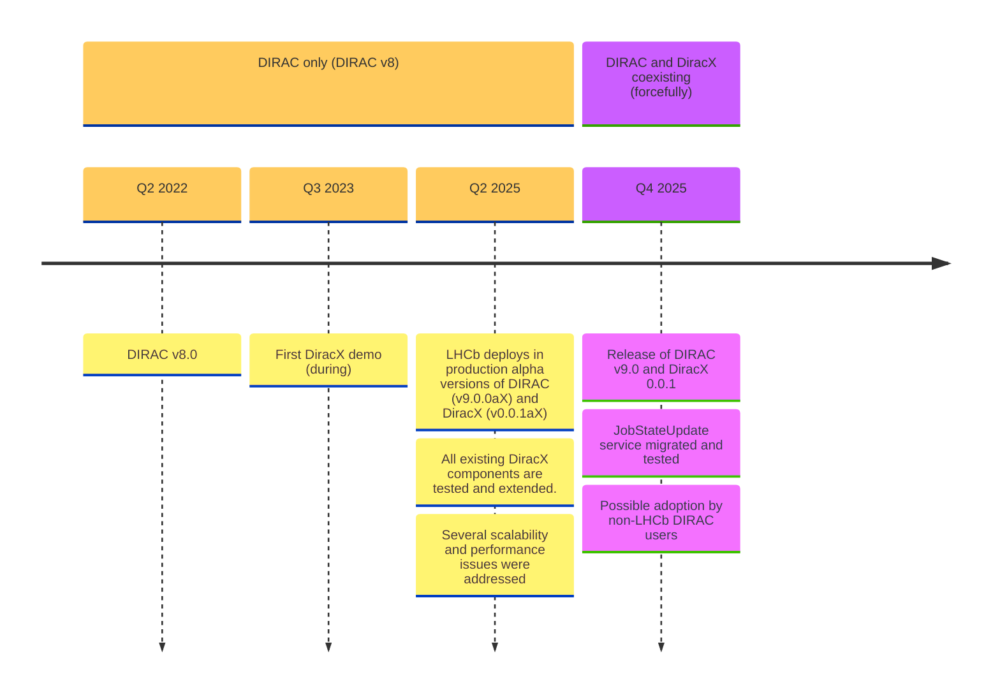
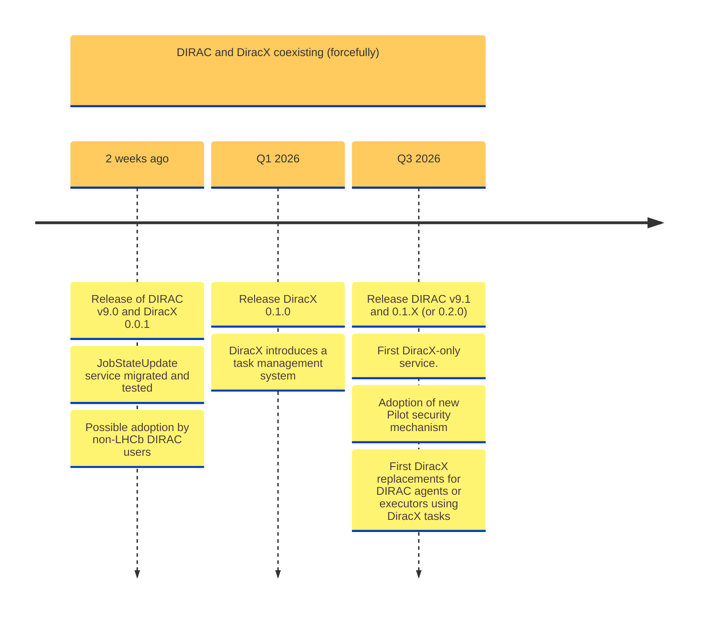
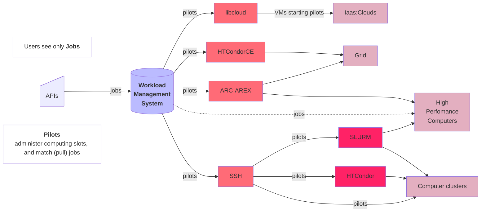
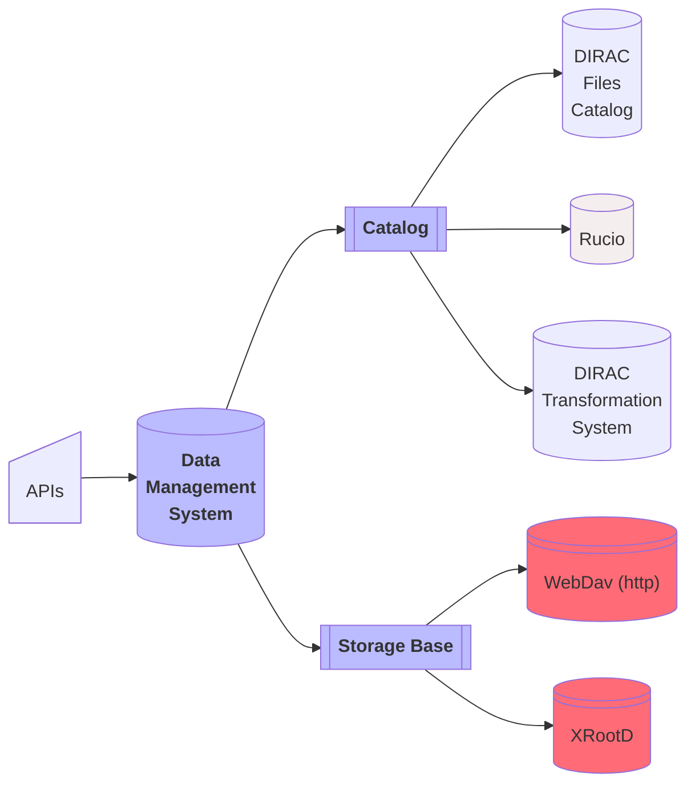
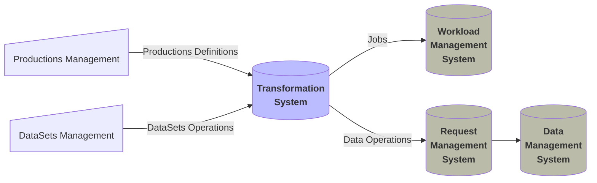

# On DIRAC, DiracX, & Rucio

**Federico Stagni** <Email v="federico.stagni@cern.ch" />

4 November 2025
\_\_ <a href="https://indico.cern.ch/event/1545309" class="ns-c-iconlink"><mdi-open-in-new />8th Rucio Community Workshop</a>

---
layout: top-title
color: gray-light
align: c
title: DIRAC
---

:: title ::

# What is DIRAC, actually?  </img>

:: content ::

- An "interware" (a tool for doing distributed computing)
- Started by LHCb, today is used by few dozens communities
- It can be used for managing jobs (via pilots), data, productions, dataset transfers, etc
- The recently refurbished [diracgrid.org](https://diracgrid.org/) explains everything and has many links for your info

In general, DIRAC has a very active community of users and developers.
- Apart from the regular zoom meetings, we meet for hackathons 3 times per year, plus once in a workshop. Next will be [14-16 Oct 2026 in Prague](https://indico.cern.ch/event/1588323/).
- For the latest presentations, check [our latest WS](https://indico.cern.ch/event/1433941/)

---
layout: top-title-two-cols
color: gray-light
align: c-lm-lm
title: numbers
---

:: title ::

# Few DIRAC numbers

:: left ::

(from A. Tsaregorodtsev)

:: right :: 

(LHCb, peak usage in the last year)

---
layout: top-title
color: gray-light
align: c
title: why
---

:: title ::

# Why this talk

:: content ::

- DIRAC is, like Rucio, a project serving several communities in their struggles to exploit distributed computing resources
- Few communities (Belle2 and CTAO, also few IUUC in GridPP) have been using, or will soon use, DIRAC and Rucio together, with (*en-gros*):
  - DIRAC as WMS (so, not using DIRAC's DMS)
  - Rucio as DMS
- There are also exploratory works on using parts of DIRAC that are not the WMS 

---
layout: side-title
side: left
color: gray-light
titlewidth: is-5
align: cm-lm
title: encounters
---

:: title ::

  </img>   </img>

# Previous encounters

:: content ::

- Rucio was presented in the [8th DIRAC's workshop](https://indico.cern.ch/event/676817/contributions/2975871/)
- a DIRAC-Rucio setup (from Belle2) was first mentioned in the [2nd Rucio WS](https://indico.cern.ch/event/773489/contributions/3316669/attachments/1803652/2942717/laycock_Rucio.pdf) and in the [9th DIRAC WS](https://indico.cern.ch/event/756635/contributions/3384793/attachments/1844896/3026476/BelleIIRucio.pdf)
- in 2023 we organized a [DIRAC & Rucio WS at KEK](https://indico.cern.ch/event/1252369/)
- at the beginning of this year we met for a [Dirac & Rucio mini-workshop and hackathon](https://indico.cern.ch/event/1443765/)

There is also a dedicated [mattermost channel](https://mattermost.web.cern.ch/diracx/channels/rucio---dirac)

---
layout: top-title
color: gray-light
align: c
title: integration
---

:: title ::

# How DIRAC and Rucio work together

:: content ::

The entry point is the DIRAC's `RucioFileCatalog`, which is an implementation of the `FileCatalog` "abstract" class (DIRAC has few different implementation of the same class, and you can `register_file()` to more than 1 catalog at the same time)
- in DIRAC since 2021
- by now it supports *Multi VO* and *Rucio metadata*
- The synchronization between DIRAC and Rucio is done via DIRAC
agents

Once the data is in the Rucio catalog, all the replication policies, 3rd party copy are handled by Rucio subscriptions and rules. 

This also means that:
- Admins still updates the DIRAC configuration
- No change for the download/upload from jobs: still done via the DIRAC's `DataManager`

---
layout: top-title
color: gray-light
align: c
title: namespace
---

:: title ::

# How DIRAC and Rucio work together -- namespace

:: content ::

- By default, Rucio has a flat namespace that contains files
  - Files that can be aggregated to datasets
  - Then datasets can be aggregated to container
- DIRAC uses a hierarchical namespace

The `RucioFileCatalog` "translates" from DIRAC to Rucio's namespace. All details in [this vCHEP presentation](https://indico.cern.ch/event/948465/contributions/4323983/attachments/2247115/3811355/The%20Rucio%20File%20Catalog%20in%20Dirac%20implemented%20for%20Belle%20II-2.pdf)

---
layout: section
color: lime-light
---

    
    -->
    

---
layout: side-title
side: left
color: gray-light
titlewidth: is-4
align: rm-lm
title: DiracX
---

:: title ::

# What is DiracX?

:: content ::

## A complete rewrite of DIRAC

- A cloud native app
- Multi-VO from the get-go
- Standards-based

<AdmonitionType type='important' >
Still DIRAC, in terms of functionalities.
</AdmonitionType>

- While DIRAC is already very modular, DiracX is even more
- With very well defined interfaces

---
layout: top-title
color: gray-light
align: c
title: points
---

:: title ::

# Notable points

:: content ::

<AdmonitionType type='note' >
There are several communities using DIRAC right now. Their business continuity is our top priority.
</AdmonitionType>

<AdmonitionType type='important' >
DIRAC and DiracX will live together for a while
</AdmonitionType>

<AdmonitionType type='info' >
One functionality at a time, we'll eventually migrate all from DIRAC to DiracX.
</AdmonitionType>

---
layout: top-title-two-cols
color: gray-light
align: c-lt-lm
title: timeline_summary
---

:: title ::

# Extreme summary of what happened in the last few years

:: left ::

:: right ::

(a somewhat personal take)

Notable points:
- In April 2025 LHCb moved the production setup to DIRAC v9 and DiracX 0.0.1 alpha versions
- 2 weeks ago we finally tagged the first non-alpha versions of v9 and DiracX

---
layout: top-title
color: gray-light
align: c
title: DiracX v0.0.1
---

:: title ::

# The first DiracX releases

:: content ::

### It contains:

- All service/client underpinnings.
- Extension support.
- Jobs sandboxes can be stored in an object store.
- The DIRAC `WorkloadManagement/JobStateUpdateHandler` service can be replaced by an "equivalent" DiracX service.
- The helm chart is considered "stable enough".
- Documentation "sufficiently complete".
- DiracX extensions working.

We will keep working, within the patches of this first version, on adding new services and documentation.

---
layout: top-title-two-cols
color: gray-light
align: c-lm-lm
title: Timeline
columns: is-7
---

:: title ::

# Timeline of the next year

:: left ::

:: right ::

- DiracX 0.1.0 will bring "tasks", for replacing DIRAC's _agents_, _executors_, and the RMS machinery (the _RequestExecutingAgent_)
- We will need a DIRAC v9.1 because there will be database changes (some PRs already in _draft_)
- Standalone DiracX will take at least 2 years from now

---
layout: top-title
color: gray-light
align: c
title: Users-WhatsNew
---

:: title ::

# What's new for users

:: content ::

<ul class="text-sm">
  <li><strong>Logging-in</strong> requires that you are previously registered in an IdP implementing OpenID Connect protocol
    <ul>
      <li>essentially this is the VOMS-&gt;IaM migration. Admins should have done this already, transparently, for all the users of a VO</li>
      <li>if a VO is not migrated to IaM, it can't be "enabled" (see later on)</li>
    </ul>
  </li>
  <li>New <strong>Web app</strong> (which, for DiracX 0.0.1 is not of much use)</li>
  <li>Enriched and modern <strong>CLI</strong> (but not many functionalities in there)</li>
  <li><strong>REST</strong> interface for programmatic usage (for advanced users -- but again, not much user-facing info to use)</li>
</ul>

But effectively, for now <strong>users can largely be agnostic</strong> of DiracX, as for the first version users' interactions will still be done via the DIRAC tools they know (and love?).

Also, users should be setting the correct environment variables (<code>DIRACX_URL</code> mostly)

<ul class="text-sm">
  <li>admins should be setting it already for the users</li>
</ul>

---
layout: side-title
side: left
color: gray-light
titlewidth: is-4
align: rm-lm
title: WebAPI
---

:: title ::

# DiracX APIs

:: content ::

DIRAC Web APIs with <devicon-fastapi-wordmark class="text-7xl align-middle inline-block mx-0"></devicon-fastapi-wordmark>

Nicely documented by <devicon-swagger-wordmark class="text-7xl align-middle inline-block mx-0"></devicon-swagger-wordmark>

Follows the <devicon-plain-openapi-wordmark class="text-7xl align-middle inline-block mx-1"></devicon-plain-openapi-wordmark> specification, with the (python) client generated by [AutoREST](https://github.com/Azure/autorest/blob/main/docs/introduction.md)
- clients in another language are just one pipeline away.

<!--
- there is also redoc
- AutoREST supports several langagues, not only python
-->

---
layout: side-title
side: right
color: gray-light
titlewidth: is-4
align: lm-lm
title: DiracX-Web
---

:: title ::

# DiracX web

:: content ::

### We are also rewriting [the Web App](https://github.com/DIRACGrid/diracx-web) from scratch.

Software stack:

- NextJS <devicon-nextjs-wordmark class="text-4xl align-middle inline-block mx-2" />
- Material UI <devicon-materialui class="text-3xl align-middle inline-block mx-2" />
- TypeScript <devicon-typescript class="text-3xl align-middle inline-block mx-2" />

(very similary to Rucio Web UI stack)

- There is no tight coupling between API and frontend: the web app acts as any other diracx client using the same set of endpoints.
- As per DiracX, DiracX-Web is extendable.

---
layout: top-title
color: gray-light
align: c 
title: DiracXWMS
---

:: title ::

# WMS evolution in DiracX

:: content ::

There are several features that will be added in the next year in DiracX (few already in DIRAC), evolving its WMS functionalities. Few examples:
- Perfecting the **Pilot push model** for closed HPCs (in parallel to the default pull model)
- A new an improved security model for pilots, using tokens
- Enforcing of CGroup2 limits for full node allocations

---
layout: top-title
color: gray-light
align: cm 
title: DiracXWMS
---

:: title ::

# WMS evolution in DiracX: CWL

:: content ::

  
  
  

---
layout: side-title
side: left
color: gray-light
titlewidth: is-5
align: cm-lm
title: next_encounters
---

:: title ::

  </img>   </img>

# What's next

:: content ::

- We started coding few tests for a DIRAC(X)+Rucio test setup but never finished. While at low priority, these will complete eventually.
- The current AuthNZ model is based on X509. That will move to tokens.
- In general, users of both DiracX and Rucio should drive the agenda on what's next.
- Probably, eventually we will organize a new DiracX+Rucio mini-WS and hackathon, or something similar.

---
layout: top-title-two-cols
align: cm-cm-lm
color: orange-light
columns: is-4
title: summary
--- 
:: title ::

# Summary

:: left :: 

 </img>

:: right ::

<ul class="text-base">
  <li>DIRAC and Rucio have been used as complementary tools for exploiting distributed computing resources for a few years already.
  </li>
    <ul class="text-sm">
      <li>The collaboration is meant to continue!</li>
      <li>DiracX will ease the interoperability with Rucio and/or any other tool out there</li>
    </ul>
  <li>DiracX is "the neXt Dirac incarnation", ensuring the future of the widely used DIRAC. The first DiracX release is here.
    <ul class="text-sm">
      <li>It will live together with DIRAC v9 for a while, until it will replace it completely</li>
      <li>DiracX will still have the Data Management part, but its Workload Management functionalities will come first</li>
    </ul>
  </li>
</ul>

---
layout: credits
color: navy
loop: true
speed: 1.0
title: credits/people
---

    

        <strong>People</strong> 
    

    

        <strong>Current Developers, maintainers, supporters</strong>
    

    

        Chris Burr <i>CERN, LHCb</i> 
        Christophe Haen <i>CERN, LHCb</i> 
        Alexandre Boyer <i>CERN, LHCb</i> 
        Natthan Piggoux <i>LUPM (FR), CTA</i> 
        Cedric Serfon <i>Brookhaven National Laboratory (US), Belle2</i> 
        Ryunosuke O'Neil <i>CERN, LHCb</i> 
        Daniela Bauer <i>Imperial college (UK), GridPP</i> 
        Simon Fayer <i>Imperial college (UK), GridPP</i> 
        Janusz Martyniak <i>Imperial college (UK), GridPP</i> 
        Xiaomei Zhang <i>Beijing, Inst. High Energy Phys. (CN), Juno</i> 
        Luisa Arrabito <i>LUPM (FR), CTA</i> 
        André Sailer <i>CERN</i> 
        Jorge Lisa Laborda <i>Univ. of Valencia and CSIC (ES), LHCb</i> 
        Bertrand Rigaud <i>IN2P3 (FR)</i>
    

    

        <strong>Project lead</strong>
    

    

        Federico Stagni <i>CERN, LHCb</i> 
        Andrei Tsaregorotsev <i>CPPM (FR), EGI and LHCb</i>
    

&nbsp;
&nbsp;
&nbsp;
&nbsp;
&nbsp;

    <strong>Questions?</strong>

---
layout: section
color: cyan-light
title: Backup
---

# Backup

---
layout: side-title
align: lm-lm
color: gray-light
title: WMS
titlewidth: is-3
---

:: title ::

## Workload Management System
- Pull model based on Pilot jobs
- Also "Push" solution for HPCs that do not support pilots (because of limited internet access).
- Will integrate [CWL (Common Workflow Language)](https://www.commonwl.org) as a way of defining jobs (replacing JDL)

:: content ::

---
layout: side-title
align: lm-lm
color: gray-light
title: DMS
titlewidth: is-5
---

:: title ::

## Data Management System
It’s about **files**:​ placing, replicating, removing files​

- there are **LFNs** (logical file names)
- **LFNs** are registered in *catalog(s)​*
    - where are the LFNs? (in the DIRAC File Catalog (DFC), or in Rucio)​
    - where are their metadata? (in the DFC, or in the LHCb Bookkeeping, or in AMGA)​
- LFNs *may* have **PFNs** (physical file names), stored in **SEs** (Storage Elements), that can be accessed with several protocols.​

:: content ::

<!-- 
A catalog is effectively an interface, that needs implementation. Such implementation can be the DIRAC Files Catalog, or Rucio, or any other, including extension specific ones
-->

---
layout: side-title
color: gray-light
align: lm-lm  
title: TS
---

:: title ::

## Transformation System
### For productions and Dataset management

- A *Data Processing* **transformation** (e.g. Simulation, Merge, DataReconstruction...) creates jobs in the WMS (and re-submits them if needed, eventually destroys them).​

- A *Data Manipulation* **transformation** replicates, or removes, data from storage elements.

:: content ::

The Transformation System is used to automate common tasks related to production activities. It can handle thousands of productions, millions of files and jobs.

&nbsp;
&nbsp;

